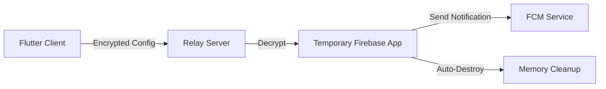

<div align="center">---

## ✨ **What Makes This Special**

This isn't just another notification service. It's a **zero-state, security-first** relay that accepts AES-encrypted Firebase credentials from your Flutter clients and sends push notifications without ever storing sensitive data.

> **💡 AlwariDev Innovation:** This package introduces a revolutionary approach to Firebase Cloud Messaging by enabling **stateless, multi-tenant notification handling** without compromising security. Built by Syed Abdul Qadeer, this solution addresses the critical gap in secure FCM relay services.

<p align="center">
    
</p>

### 🎯 **Perfect For**
- 📱 **Flutter Apps** that need dynamic Firebase project switching
- 🏢 **Multi-tenant SaaS** applications
- 🔐 **Security-conscious** developers who refuse to store credentials
- ⚡ **Serverless deployments** that need stateless operation

---

# 🔥 Firebase Notification Handler

### *Stateless • Secure • Lightning Fast*

A **production-ready** Node.js microservice that securely handles Firebase Cloud Messaging through encrypted service account relaying.

**Developed with ❤️ by [AlwariDev](https://github.com/SyedAbdulQadeer)**


</div>

---

## ✨ **What Makes This Special**

This isn't just another notification service. It's a **zero-state, security-first** relay that accepts AES-encrypted Firebase credentials from your Flutter clients and sends push notifications without ever storing sensitive data.

### 🎯 **Perfect For**
- � **Flutter Apps** that need dynamic Firebase project switching
- 🏢 **Multi-tenant SaaS** applications
- 🔐 **Security-conscious** developers who refuse to store credentials
- ⚡ **Serverless deployments** that need stateless operation

---

## 🚀 **Key Features**

<table>
<tr>
<td align="center">🔒</td>
<td><strong>Zero Credential Storage</strong><br/>Service accounts are decrypted, used once, and destroyed</td>
</tr>
<tr>
<td align="center">⚡</td>
<td><strong>Lightning Performance</strong><br/>Built with Node.js HTTP module for minimal overhead</td>
</tr>
<tr>
<td align="center">🛡️</td>
<td><strong>Military-Grade Encryption</strong><br/>AES-256-CBC with customizable keys</td>
</tr>
<tr>
<td align="center">🌐</td>
<td><strong>CORS Ready</strong><br/>Works seamlessly with web and mobile clients</td>
</tr>
<tr>
<td align="center">🔄</td>
<td><strong>Auto-Cleanup</strong><br/>Firebase apps are automatically destroyed after each request</td>
</tr>
<tr>
<td align="center">📊</td>
<td><strong>Comprehensive Logging</strong><br/>Detailed request/response tracking for debugging</td>
</tr>
</table>

---

## �️ **Quick Start**

### **1. Clone & Install**
```bash
git clone <repository-url>
cd firebase_notification_handler
npm install
```

### **2. Configure Environment**
```bash
cp .env.example .env
```

Edit `.env` with your secret key:
```env
SECRET_KEY=your_super_secure_32_character_key
PORT=3000
```

### **3. Launch Server**
```bash
npm start
```

🎉 **Your relay is now running at `http://localhost:3000`!**

---

## 🔌 **API Documentation**

### **📤 Send Notification**

**Endpoint:** `POST /sendNotification`

#### **Request Format**
```json
{
  "firebaseConfig": "encrypted_base64_service_account_json",
  "token": "recipient_fcm_token", 
  "title": "Your notification title",
  "body": "Your notification message"
}
```

#### **Success Response** ✅
```json
{
  "success": true,
  "response": {
    "messageId": "projects/your-project/messages/0:1234567890"
  },
  "message": "Notification sent successfully",
  "timestamp": "2025-10-05T10:30:00.000Z"
}
```

#### **Error Response** ❌
```json
{
  "success": false,
  "error": "Invalid Firebase configuration"
}
```

---

## 📁 **Project Structure**

```
firebase_notification_handler/
├── 📄 index.js                # Main library entry point
├── 📄 server.js               # HTTP server entry point
├── 📄 package.json            # Dependencies & scripts
├── 📄 .env.example            # Environment template
├── 📄 .gitignore              # Git exclusions
├── 📄 vercel.json             # Vercel deployment config
├── 📄 README.md               # This beautiful documentation
├── 📁 src/                    # Source code directory
│   ├── 📄 server.js           # Optimized server implementation
│   ├── 📁 config/             # Configuration management
│   │   └── 📄 environment.js  # Environment variable handling
│   ├── 📁 core/               # Core business logic
│   │   └── 📄 firebase-service.js # Firebase messaging service
│   ├── 📁 middleware/         # Request processing middleware
│   │   └── 📄 request-handler.js # Main request handler
│   └── 📁 utils/              # Utility modules
│       ├── 📄 index.js        # Utils index
│       ├── 📄 crypto.js       # AES encryption/decryption
│       ├── 📄 http.js         # HTTP utilities
│       ├── 📄 logger.js       # Enhanced logging
│       └── 📄 validator.js    # Request validation
├── 📁 examples/               # Usage examples and tests
│   ├── 📄 test-helper.js      # Comprehensive test helper
│   ├── 📄 basic-usage.js      # Basic library usage
│   ├── 📄 batch-notifications.js # Batch sending example
│   └── 📄 http-server.js      # HTTP server example
└── 📁 tests/                  # Test directory (future expansion)
```

---

## 📚 **Library Usage**

### **Programmatic Usage**

```javascript
const FirebaseNotificationHandler = require('firebase_notification_handler');

// Initialize the handler
const handler = new FirebaseNotificationHandler();

// Send a notification
const result = await handler.sendNotification({
    encryptedServiceAccount: 'your_encrypted_config',
    secretKey: 'your_secret_key',
    token: 'recipient_fcm_token',
    title: 'Hello!',
    body: 'Message from AlwariDev'
});

console.log('Message ID:', result.messageId);
```

### **HTTP Server Usage**

```javascript
const FirebaseNotificationHandler = require('firebase_notification_handler');

// Create and start HTTP server
const handler = new FirebaseNotificationHandler();
const server = handler.createServer();
// Server is now running on port 3000
```

### **Batch Notifications**

```javascript
const notifications = [
    { token: 'token1', title: 'Title1', body: 'Body1' },
    { token: 'token2', title: 'Title2', body: 'Body2' }
];

const result = await handler.sendBatchNotifications({
    encryptedServiceAccount: 'your_encrypted_config',
    secretKey: 'your_secret_key',
    notifications
});

console.log(`Sent: ${result.successCount}, Failed: ${result.failureCount}`);
```

---

## 🧪 **Testing Your Setup**

### **Quick Test with Helper**
```bash
npm run test-helper
```

### **Manual cURL Testing**
```bash
# Health check
curl http://localhost:3000/health

# Send notification
curl -X POST http://localhost:3000/sendNotification \
  -H "Content-Type: application/json" \
  -d '{
    "firebaseConfig": "your_encrypted_config_here",
    "token": "user_fcm_token",
    "title": "Test Notification",
    "body": "Hello from Firebase Relay! 🚀"
  }'
```

### **Example Usage Scripts**
```bash
# Basic usage example
node examples/basic-usage.js

# Batch notifications example
node examples/batch-notifications.js

# HTTP server example
node examples/http-server.js
```

---

## 🔐 **Security Architecture**

### **Encryption Specifications**
- **Algorithm:** `AES-256-CBC`
- **Key Source:** Environment variable `SECRET_KEY`
- **IV:** 16 zero-bytes (`Buffer.alloc(16, 0)`)
- **Encoding:** Base64

### **Security Flow**


### **🛡️ Security Guarantees**
- ✅ **No persistent storage** of Firebase credentials
- ✅ **Temporary app lifecycle** (create → use → destroy)
- ✅ **Encrypted transmission** of sensitive data
- ✅ **Environment-based** secret management

---

## � **HTTP Status Codes**

| Code | Meaning | When It Happens |
|------|---------|----------------|
| `200` | ✅ **Success** | Notification sent successfully |
| `400` | ❌ **Bad Request** | Missing required fields or invalid JSON |
| `404` | 🔍 **Not Found** | Wrong endpoint (only `/sendNotification` works) |
| `405` | 🚫 **Method Not Allowed** | Non-POST requests |
| `500` | 💥 **Internal Error** | Server-side issues (encryption, Firebase errors) |

---

## 🚀 **Deployment Options**

### **Vercel (Recommended)**
```bash
npm i -g vercel
vercel --prod
```

### **Railway**
```bash
railway login
railway deploy
```

### **Docker**
```dockerfile
FROM node:18-alpine
WORKDIR /app
COPY package*.json ./
RUN npm ci --only=production
COPY . .
EXPOSE 3000
CMD ["npm", "start"]
```

### **Traditional VPS**
```bash
# Install PM2 for process management
npm install -g pm2
pm2 start server.js --name "firebase-relay"
pm2 startup
pm2 save
```

---

## 🔧 **Environment Variables**

| Variable | Required | Default | Description |
|----------|----------|---------|-------------|
| `SECRET_KEY` | ✅ **Yes** | - | AES encryption key (must match Flutter client) |
| `PORT` | ❌ No | `3000` | Server listening port |

---

## 🧑‍💻 **Contributing**

We welcome contributions! Here's how to get started:

1. **Fork** this repository
2. **Create** a feature branch (`git checkout -b feature/amazing-feature`)
3. **Commit** your changes (`git commit -m 'Add amazing feature'`)
4. **Push** to the branch (`git push origin feature/amazing-feature`)
5. **Open** a Pull Request

---

## ⚡ **Performance Metrics**

- **Cold Start:** < 500ms
- **Warm Request:** < 100ms
- **Memory Usage:** ~25MB base
- **Concurrent Requests:** 1000+ (depending on infrastructure)

---

## 🆘 **Troubleshooting**

<details>
<summary><strong>🔴 "SECRET_KEY environment variable is required"</strong></summary>

**Solution:** Ensure your `.env` file exists and contains:
```env
SECRET_KEY=your_actual_secret_key
```
</details>

<details>
<summary><strong>🟡 "Invalid Firebase configuration"</strong></summary>

**Causes:**
- Incorrect AES encryption on client side
- Wrong `SECRET_KEY` value
- Malformed service account JSON

**Solution:** Verify your Flutter client uses the same encryption key and algorithm.
</details>

<details>
<summary><strong>🟠 Firebase permission errors</strong></summary>

**Solution:** Ensure your service account JSON has the `Firebase Cloud Messaging API` permission enabled in Google Cloud Console.
</details>

---

## 📜 **License**

This project is licensed under the **ISC License** - see the [LICENSE](LICENSE) file for details.

---

## �‍💻 **About the Developer**

<div align="center">

**Syed Abdul Qadeer**  
*CEO & Founder of AlwariDev*  
*Lead Developer & Architect*

[](https://github.com/SyedAbdulQadeer)
[](https://github.com/AlwariDev)

</div>

---

## �🙏 **Acknowledgments**

- **Firebase Team** for the amazing Admin SDK
- **Node.js Community** for the robust runtime
- **Security Researchers** who inspired the zero-trust architecture

---

<div align="center">


### 💻 **Crafted with ❤️ by AlwariDev**
### 🏗️ **Developed by Syed Abdul Qadeer**

**⭐ Star this repo if it helped you build something amazing!**

*Ready to relay your Firebase notifications securely! 🔥📱*

---

**© 2025 AlwariDev. All rights reserved.**

</div>


</div>
